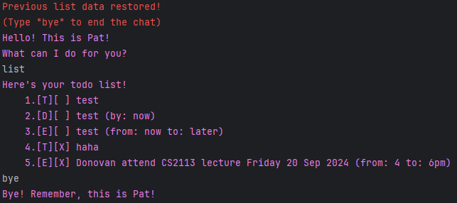

# Pat User Guide



Pat is a CLI chatbot that helps you keep track of your tasks and your progress. Inspired by Patrick Star.

## Ending the Chat: `bye`

> [!Warning]
> Your list is only saved when the `bye` command is given. 

Ends your chat with Pat and tries to save your list in `./data/list.txt`.

Format: `bye`

Example output:

```
Directory "data" created.
File "list.txt" created.
Bye! Remember, this is Pat!
```

## Adding Todos: `todo`

Adds a simple Todo with only a description of the task to the task list.

Format: `todo [description]`

Example: Assuming the list initially had 5 items, `todo Watch Dune` returns

```
Added this task:
    [T][ ] Watch Dune
Now you have 6 tasks in the list
``` 

## Adding Deadlines: `deadline`

Adds a Deadline with a task description and a deadline by which it should be completed by to the task list.

Format: `deadline [description] /by [deadline]`

Example: Assuming the list initially had 5 items, `deadline Cook pancakes /by 9am` returns

```
Added this task:
    [D][ ] Cook pancakes (by: 9am)
Now you have 6 tasks in the list
```

## Adding Events: `event`

Adds an Event with a task description and a start and stop time to the task list.

Format: `event [description] /from [start time] /to [end time]`

Example: Assuming the list initially had 5 items, `event Attend lecture /from 10am /to 12pm` returns

```
Added this task:
    [E][ ] Attend lecture (from: 10am to: 12pm)
Now you have 6 tasks in the list
```

## Listing All Tasks: `list`

Shows a list of all tasks in the list.

Format: `list`

Example:

```
Here's your todo list!
    1.[T][ ] test
    2.[D][ ] test (by: now)
    3.[E][ ] test (from: now to: later)
    4.[T][X] haha
    5.[E][X] Donovan attend CS2113 lecture Friday 20 Sep 2024 (from: 4 to: 6pm)
```

## Finding Tasks: `find`

Finds task whose description contains the provided key phrase. The task number of the tasks found are notably the same as their number in the task list. 

Format: `find [key phrase]`

Example: From the `list` example above, 
- `find test` returns 
```
Here are the matching tasks in your list:
    1.[T][ ] test
    2.[D][ ] test (by: now)
    3.[E][ ] test (from: now to: later)
```
- `find e` returns
```
Here are the matching tasks in your list:
    1.[T][ ] test
    2.[D][ ] test (by: now)
    3.[E][ ] test (from: now to: later)
    5.[E][X] Donovan attend CS2113 lecture Friday 20 Sep 2024 (from: 4 to: 6pm)
```
- `find 13` returns
```
Here are the matching tasks in your list:
    5.[E][X] Donovan attend CS2113 lecture Friday 20 Sep 2024 (from: 4 to: 6pm)
```

## Deleting Tasks: `delete`

Deletes the task with the specified number from the task list.

Format: `delete [task number]`

Example: `delete 2` deletes the 2nd task in the task list according to the `list` or `find` commands.

## Marking Tasks as Done: `mark`

Marks the task with the specified number from the task list as done.

Format: `mark [task number]`

Example: `mark 3` marks the 3rd task in the task list according to the `list` or `find` commands as done.  

## Unmarking Tasks as Not Done: `unmark`

Unmarks the task with the specified number from the task list as not done.

Format: `unmark [task number]`

Example: `unmark 3` unmarks the 3rd task in the task list according to the `list` or `find` commands as not done.  
